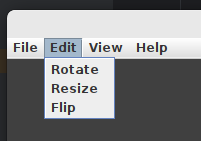
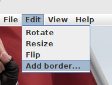
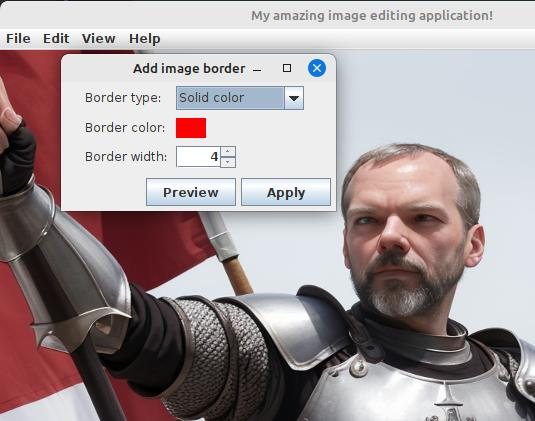
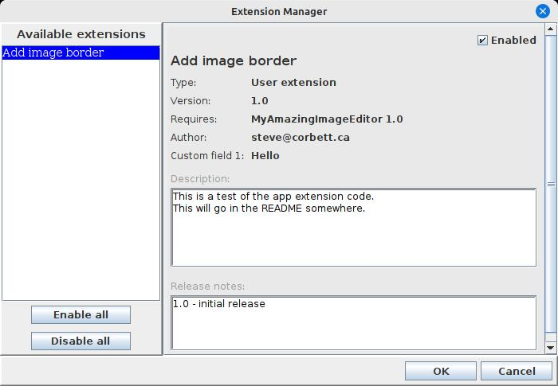
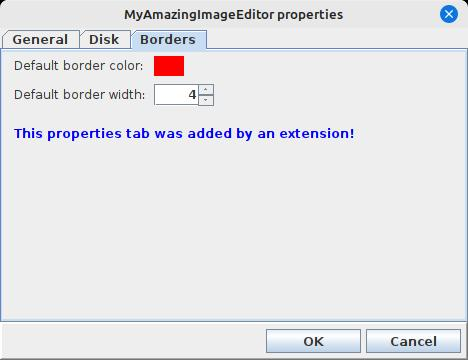

# app-extensions

## What is this?

The `app-extensions` library allows you to make your Java application much more extensible
by providing ways for you to dynamically load application extensions to change or enhance
the behaviour of your application, even without changing your application code itself.

## How does it work?

When designing your application, you identify certain "extension points" - that is, parts
of the code where an extension could either change the way that something is done, or add
additional functionality that the application does not do out of the box.

For example, let's say we're writing an application that accepts input in the form
of Xml files, extracts information from those files, and writes it to a database.
The loading of the input files is an obvious extension point. Could we write an extension
that would allow the application to accept input in other formats? Json or CSV, for example?

For a more complex example, let's say we are writing an image editing application that
supports certain image edit operations out of the box: rotate, flip, resize, and so on.
Could we write an extension that dynamically adds a completely new image editing operation
to our application, without changing the code of our application itself?

The `app-extensions` library provides a way to handle both of the example scenarios,
and many more.

## How do I get it?

If you're using Maven, you can just add it as a dependency:

```xml
<dependencies>
  <dependency>
    <groupId>ca.corbett</groupId>
    <artifactId>app-extensions</artifactId>
    <version>1.9.0</version>
  </dependency>
</dependencies>
```

## Designing an application with extensions in mind

The first and most important step is to identify possible extension points in your code.
Let's start with the simpler of our two examples above: we want our application to be 
able to accept input in other file formats. Okay, let's start by implementing the
`AppExtension` interface for our fictional application:

```java
public abstract class MyExtension implements AppExtension {
    
    public abstract boolean isFormatSupported(File inputFile);
}
```

We've created an abstract class for our application and implemented the `AppExtension`
interface. We then add a new abstract method called `isFormatSupported` that accepts
a candidate file and returns either true or false based on that file's format. But
where is the logic for this method? Why not just implement right here? 

**Because we don't want the application to know what additional formats are supported**.

The whole point of offloading this logic into an extension class is that the extension class
might not exist yet. In fact, the file format that we eventually want to support might
also not exist yet. We're coding for a future that hasn't happened yet. Putting the logic
into the application would make the application inflexible about what formats it supports,
and would require a new version of the application code down the road when we want to add
support for a new file format later. The whole point of this library is to avoid that.

We will also need a way for the extension to load data from the input file and return it,
presumably in the form of some model object that our application deals with. Let's do that next:

```java
public abstract class MyExtension implements AppExtension {
    
    public abstract boolean isFormatSupported(File inputFile);
    
    public abstract MyModelObject loadFromFile(File inputFile) 
            throws InputFormatNotSupportedException, InputProcessingException;
}
```

Okay, now we have an abstract method that our application code can invoke when loading data
from input files. But the logic for this method does not exist yet and in fact won't ever
exist within our application's codebase. In theory, our application can support
any format we want, via extensions.

But we're not done yet. We have to write our application code to consider the existence
and the capabilities of any extensions that may be present at runtime. Let's extend the
`ExtensionManager` class and add some logic to it:

```java
public class MyExtensionManager extends ExtensionManager<MyExtension> {
    // ...
    // skipping some boilerplate for now
    // ...
    
    public boolean isFormatSupported(File inputFile) {
        for (MyExtension extension : getAllLoadedExtensions()) {
            if (extension.isFormatSupported(inputFile)) {
                return true;
            }
        }
        return false;
    }
    
    public MyModelObject loadFromFile(File inputFile) 
        throws InputFormatNotSupportedException, InputProcessingException {
        for (MyExtension extension : getAllLoadedExtensions()) {
            if (extension.isFormatSupported(inputFile)) {
                return extension.loadFromFile(inputFile);
            }
        }
        return null;
    }
}
```

The methods we add here wrap the functionality offered by our currently loaded
extensions (if any). Now we in theory have what we need to modify our application's
loading code to take extensions into consideration:

```java
// ... somewhere in our application code ...
public MyModelObject loadInputFile(File inputFile) 
    throws InputFormatNotSupportedException, InputProcessingException {
    // If it's an xml file, we can handle it natively:
    if (isXmlFile(inputFile)) {
        return loadXmlInputFile(inputFile);
    }
    
    // Otherwise, see if any of our extensions know how to handle this file type:
    if (MyExtensionManager.getInstance().isFormatSupported(inputFile)) {
        return MyExtensionManager.getInstance().loadFromFile(inputFile);
    }
    
    throw InputFormatNotSupportedException("Input file is not in a supported format.");
}
```

First, we check to see if the input file is in a format recognized by our application code
itself. If so, we can handle it natively, the same way we would have before adding extension
support to our application. But, if the format is unknown to us, instead of simply giving up,
we can ask our extension manager if there are any registered extensions that know how to
process that file type. If so, we can get that extension to handle the loading of the input
file, even without our application knowing or caring about the particulars of what format it's in.

Using this same basic pattern, we can augment our application in any number of ways,
allowing extensions to either enhance existing processing, or even to add new processing
options that the original application codebase didn't even think of.

## A more complex example - adding new functionality

Let's look at a more complex hypothetical scenario - we're writing an image editing
application where the user can bring up an image and do certain manipulations to it:
resize it, rotate it, mirror it, and etc. Many of these basic operations can be provided
by the application code itself. But what if we want to support the idea that an extension
could offer a brand-new image editing operation that we didn't even think of when writing
the application? Can we do it? Sure!

Let's again start by implementing the `AppExtension` interface, but this time let's
keep it vague instead of focusing on specific actions like loading an input file:

```java
public abstract class MyExtension implements AppExtension {
    
    public abstract List<AbstractAction> getImageEditActions();
} 
```

This abstract method allows an extension to return a list of `AbstractAction`
instances related to image editing. Let's again add a wrapper around this 
method to our extension manager class:

```java
public class MyExtensionManager extends ExtensionManager<MyExtension> {
    
    public List<AbstractAction> getImageEditActions() {
        List<AbstractAction> allActions = new ArrayList<>();
        for (MyExtension extension : getAllLoadedExtensions()) {
            List<AbstractAction> actions = extension.getImageEditActions();
            if (actions != null && ! actions.isEmpty()) {
                allActions.addAll(actions);
            }
        }
        return allActions;
    }
}
```

With this in place, our application can offer additional functionality wherever we
are building up a list of possible image edit actions. For example, when building
our edit menu:

```java
private JMenu buildImageEditMenu() {
    JMenu menu = new JMenu("Edit");
    
    // Add the ones we know about natively:
    menu.add(new JMenuItem(imageRotateAction));
    menu.add(new JMenuItem(imageResizeAction));
    menu.add(new JMenuItem(imageFlipAction));
    
    // Now add any provided by our extensions:
    for (AbstractAction action : MyExtensionManager.getInstance().getImageEditActions()) {
        menu.add(new JMenuItem(action));
    }
}
```

When we initially release our application, there will not yet be any extensions for it,
so the menu will only show the image edit actions that shipped with the application.
But over time, as extensions are written and published, our image edit menu will automatically
expand to include them.



But what happens when one of those extension actions is invoked? What can an extension
actually do? Well, pretty much whatever you want. Let's look at extension code for
our hypothetical image editing application:

```java
public class AddImageBorderExtension extends MyExtension {
    
    @Override
    public List<AbstractAction> getImageEditActions() {
        List<AbstractAction> actionList = new ArrayList<>();
        actionList.add(new AddImageBorderAction());
        return actionList;
    }
}
```

And the code for our custom action is similarly simple:

```java
public class AddImageBorderAction extends AbstractAction {
    
    public AddImageBorderAction() {
        super("Add border...");
    }
    
    @Override
    public void actionPerformed(ActionEvent e) {
        if (MainWindow.getInstance().getSelectedImage() == null) {
            JOptionPane.showMessageDialog(MainWindow.getInstance(), "Nothing selected.");
        }
        
        new AddImageBorderDialog(MainWindow.getInstance()).setVisible(true);
    }
}
```

Our extension code can reference whatever it needs from the application codebase,
because extensions are built using that code. So, as long as our application provides
ways for extensions to query for things (like `MainWindow.getInstance()` and `getSelectedImage()`),
then they will be able to interact with those things.

So now, when we register our `AddImageBorderExtension`, our new menu item will
show up automatically, and the new image editing functionality supplied by our
extension is added to the application.

## Registering an extension

Extensions have to package up a file called `extInfo.json` in their jar file.
The file can live anywhere, but a fully-qualified package name directory structure
in the jar resources is a good convention. This file contains information about our
extension:

```json
{
  "name": "Add image border",
  "author": "steve@corbett.ca",
  "version": "1.0",
  "targetAppName": "MyAmazingImageEditor",
  "targetAppVersion": "1.0",
  "shortDescription": "Add a configurable border to selected image",
  "longDescription": "This is a test of the app extension code.\nThis will go in the README somewhere.",
  "releaseNotes": "1.0 - initial release",
  "customFields": {
    "Custom field 1": "Hello"
  }
}
```

We can specify a name and description of our extension, but more importantly,
we can specify an application name and version, which we'll use in a moment when loading
the extension. We can also specify custom fields in the form of name/value pairs of
additional information for this extension. Let's try that out just to see what happens. 

Okay, so, how do we tell our application about our new extension? And how does the application
actually load them? Well, that's what the `ExtensionManager` class is for. Somewhere
in our application startup, we should ask our extension manager to load all extensions
from jars in some known location (perhaps in an "extensions" folder in our application
install directory, or by prompting the user for it):

```java
File extensionDir = new File("...some directory with extension jars...");
MyExtensionManager.getInstance().loadExtensions(extensionDir, MyAppExtension.class, "MyAmazingImageEditor", "1.0");
```

The `loadExtensions` method takes some parameters to help it find jar files that are appropriate
for this application. Specifically, we have to pass in the class of our `AppExtension` 
implementation. We also provide an application name and version. This is so that extension
manager can weed out extension jars that target some other application, or extension jars
that target the wrong version of this application.

On startup, we now see that our application has registered and our menu 
item appears:



And when we click this new menu item, we see our border dialog comes up:



## Managing extensions, and enabling/disabling them at runtime

Wouldn't it be nice if we could provide our users with a user-friendly view
of all loaded extensions, and maybe provide a way to enable and disable them
at runtime? Well, for that we have `ExtensionManagerDialog`!



When we launch the `ExtensionManagerDialog` from our application code, we can get
a visual listing of all currently loaded extensions and their metadata. Here,
we see not only the information that we supplied about our extension, but also the
custom field that we added to our json is also present. Here, the user has the 
ability to enable or disable extensions. This requires a bit more work in our application
code! In our case, if the user disables our AddImageBorder extension, we no longer
want the menu item or the dialog to show up. So, we would have to regenerate our
main menu bar. Other applications may have to re-render their UI after every time
the `ExtensionManagerDialog` is shown, in order to show or hide controls
provided by those extensions.

The best part about `ExtensionManagerDialog` is that we don't have to write a single
line of UI code in our application - we get it for free from the `app-extensions` library!
Also, the logic for enabling/disabling extensions is wrapped up in the
`ExtensionManager` base class, so our derived class simply inherits it.

## Custom properties for extensions

What if our extension has many options, and we want to be able to expose those
options to the user in a friendly way so that they can be persisted? It turns out
that the `app-extensions` library builds on the `swing-extras` library, which already
has some code related to this. We can modify our `ExtensionManager` implementation
to accommodate this. In fact, one of the methods present in the `AppExtension`
interface is `getConfigProperties`:

```java
public class AddImageBorderExtension implements MyAppExtension {
    
    @Override
    public List<AbstractProperty> getConfigProperties() {
        // ...
    }
}
```

This method gives extensions a way of returning a list of configuration properties.
You can take a look at some of the facilities in the `swing-extras` library to see
what's possible here, specifically the [PropertiesManager](https://github.com/scorbo2/swing-extras/blob/master/docs/properties.md).

Let's modify our extension to return some custom config properties:

```java
public class AddImageBorderExtension implements MyAppExtension {
    
    @Override
    public List<AbstractProperty> getConfigProperties() {
        List<AbstractProperty> props = new ArrayList<>();
        
        props.add(new ColorProperty("UI.Borders.color", "Default border color:", ColorType.SOLID, Color.RED));
        props.add(new IntegerProperty("UI.Borders.thickness", "Default border width:", 4,0,100,1));
        
        LabelProperty label = new LabelProperty("UI.Borders.label", 
                  "This properties tab was added by an extension!");
        label.setExtraMargins(12,12);
        label.setColor(Color.BLUE);
        props.add(label);
        
        return props;
    }
}
```

And in our application startup code, we can gather all of our properties
and all of our extension properties together when creating our `PropertiesManager`:

```java
private void loadConfig() {
    List<AbstractProperty> props = new ArrayList<>();
    
    // Load the properties that our application natively knows about:
    props.addAll(getGeneralProps());
    props.addAll(getDiskProps());
    
    // Also ask our ExtensionManager for any extension-supplied props:
    props.addAll(MyExtensionManager.getInstance().getAllEnabledExtensionProperties());
    
    propsManager = new PropertiesManager(PROPS_FILE, props, "MyAmazingImageEditor");
    propsManager.load();
}
```

Now, when we generate and launch the `PropertiesDialog` from our application code,
we see that our extension's properties have been added to a new tab:



And we didn't have to write any UI code at all to support this! 

### Using AppProperties to combine PropertiesManager and ExtensionManager

To make things just a little bit easier, `app-extensions` also includes a
wrapper class `AppProperties`, which combines a custom `ExtensionManager` 
together with a `PropertiesManager` instance. This allows those two classes
to co-ordinate things like the enabled/disabled status of extensions, and makes
the client code just a little easier to manage. Basically, once our `AppProperties`
instance exists, we can invoke the `save()` and `load()` methods as needed to
load properties and extension enabled status to and from our config file.

Setting up a new `AppProperties` instance is fairly straightforward:

 ```java
 public class MyAppProps extends AppProperties<MyAppExtension> {
    public MyAppProps() {
        super("MyAmazingImageEditor", new File("mypropsfile"), MyExtensionManager.getInstance());
    }

    @Override
    protected List<AbstractProperty> createInternalProperties() {
        List<AbstractProperty> props = new ArrayList<>();

        // Load the properties that our application natively knows about:
        props.addAll(getGeneralProps());
        props.addAll(getDiskProps());

        return props;
    }
}
```

Basically, we just need to provide the location on disk where our configuartion should
be saved and loaded, and then override the `createInternalProperties` method
to specify the properties that our application knows about natively.

But wait... where do we load the properties from our extensions? We had to do that
manually earlier, didn't we? It turns out the `AppProperties` class can do this for us,
because it contains both a `PropertiesManager` and an `ExtensionManager` together. 
So, our application code can be simplified a bit.

There are convenience methods in `AppProperties` that make generating and showing
the properties dialog and the extension manager dialog very simple:

```java
// Show the application properties dialog:
myAppProps.showPropertiesDialog(MainWindow.getInstance());

// Show the extension manager:
if (myAppProps.showExtensionDialog(MainWindow.getInstance())) {
    // User okayed the dialog with changes...
    // That means we have to reload our UI to show/hide controls as needed!
}
```

Great! Having the configuration properties managed by `PropertiesManager` and the
extension enabled/disabled status managed by `ExtensionManager` makes our code so
much easier. Combining those two classes together into a custom `AppProperties` class
makes it even easier!

## Where to from here?

This README has covered the basics of writing an extension for an application
and loading it dynamically. This library is deceptively powerful, and allows you to
write extremely extensible code relatively easily without a lot of UI headaches.
I have used it in several applications to great effect.

Refer also to the library's javadocs for more detailed usage information!

## License

`app-extensions` is made available under the MIT license: https://opensource.org/license/mit

## Revision history

`app-extensions` was written late in 2023 and was published on github in 2025.
